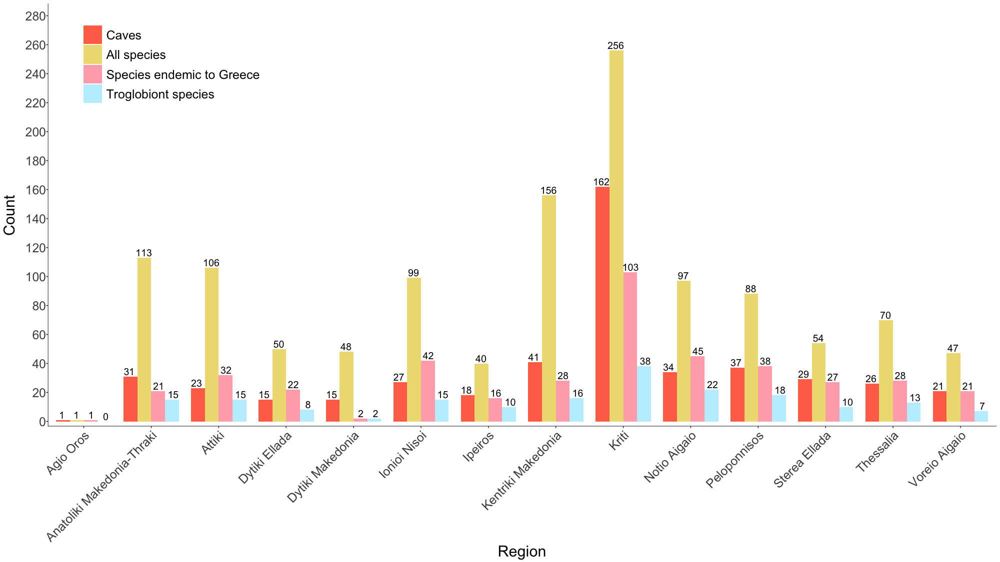
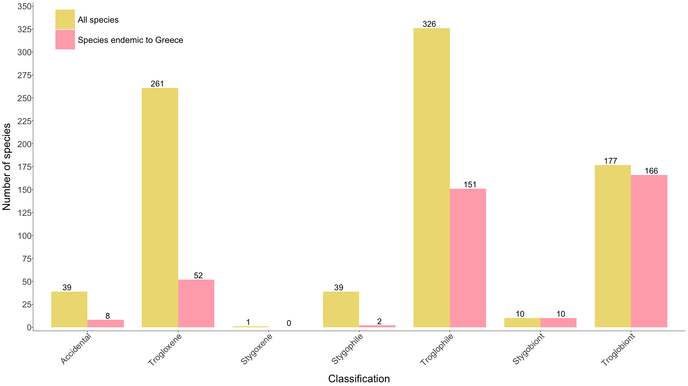
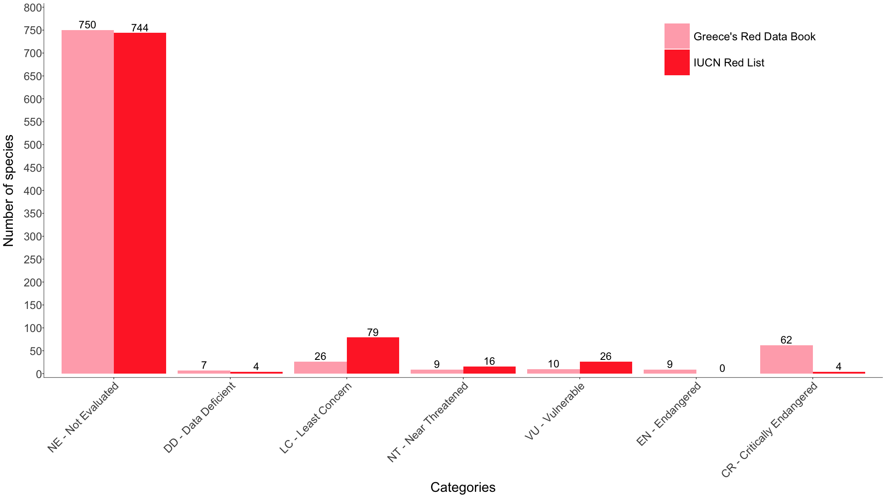
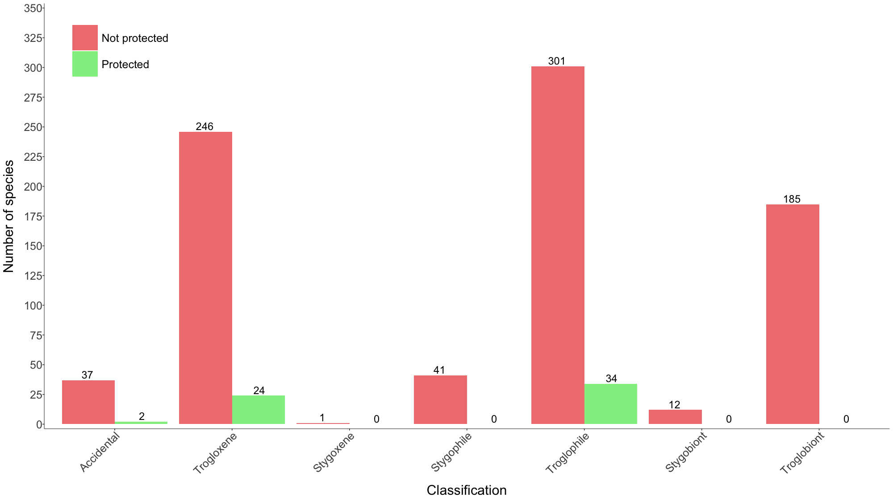
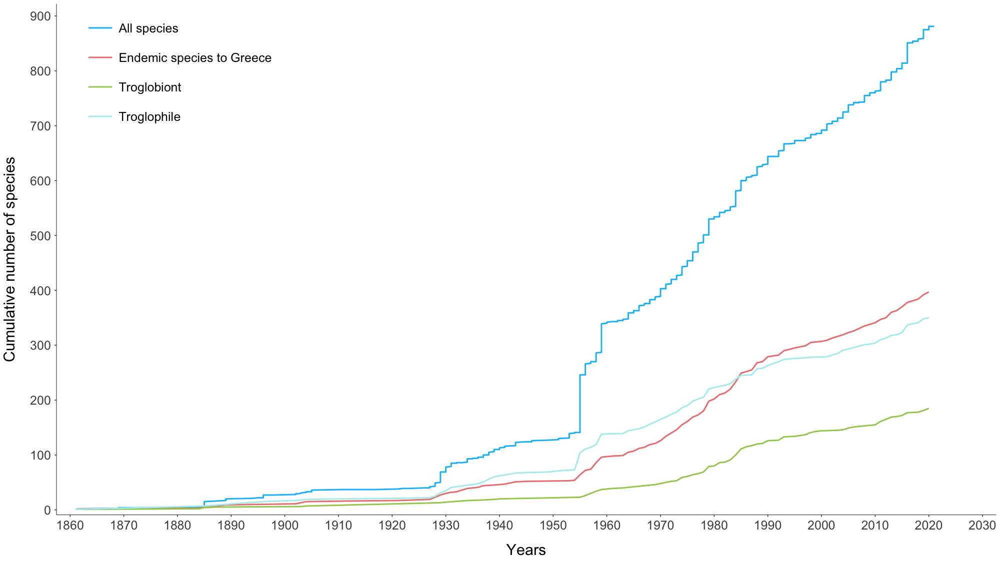

```{r, warning=FALSE, message=FALSE, echo=FALSE}
### Working Directory

#setwd("C:/Users/inikoloudakis/Dropbox/INSPEE Team Folder/Conservation of the cave fauna of Greece - MAVA/Cave_Fauna_database/Cave_Fauna_Database_Analysis")

# Data manipulation packages
library(readxl)
library(readr)
library(ggplot2)
library(scales)
library(gridExtra)
library(grid)
library(reshape2)
library(dplyr)
library(knitr)
library(kableExtra)
library(tidyr)
library(httr)
library(broom)
library(stringr)

## Data for species

library(rredlist)
library(taxize)
library(rgbif)
library(ISOcodes)
library(spocc)

# Spatial analysis packages

# x <- c("spocc","isocodes","rgbif","taxize","rredlist","raster","RColorBrewer","ggmap", "rgdal", "rgeos", "maptools", "tmap","Rcpp","sp")
# #install.packages(x) # warning: uncommenting this may take a number of minutes
# lapply(x, library, character.only = TRUE)
library(RColorBrewer)
library(ggmap)
library(rgdal)
library(geosphere)
library(GISTools)
library(leaflet)
library(rgeos)
library(maptools)
library(tmap)
library(Rcpp)
library(sp)
library(raster) ##Load the Raster Library

# Species statistics

library(red)
library(vegan)

packages <- c("readxl","readr","ggplot2","scales","gridExtra","dplyr", "knitr", "tidyr","RColorBrewer","ggmap","rgdal","rgeos","maptools","tmap","Rcpp","sp","raster","broom","red","vegan")

write_bib(x = packages,file = "packages_used.bib")

```


```{r, warning=FALSE, message=FALSE, echo=FALSE}
# Store the file names of the Data folder
 
 data_files <- list.files(path = "Data")
 
 # Data import from Database Export, the files are choosen automatically based on their name. The folder Data must contain only the latest data files.
 Cave_References <- read_delim(file = paste0("Data/",grep("Cave_References",data_files,value = TRUE)),delim = "\t")
 
 caves <- read_delim(file = paste0("Data/",grep("Caves",data_files,value = TRUE)),delim = "\t")
 
 census <- read_delim(file = paste0("Data/",grep("Census_\\d",data_files,value = TRUE)),delim = "\t")
 
 Census_references <- read_delim(file = paste0("Data/",grep("Census_references",data_files,value = TRUE)),delim = "\t")
 
species <- read_delim(file = paste0("Data/",grep("Species_",data_files,value = TRUE)),delim = "\t") %>% mutate(Classification=gsub(pattern="\\?",replacement = "",x = Classification))# Data import from Database Export

```


```{r, warning=FALSE, message=FALSE, echo=FALSE}
census$species_epithet <- as.character(lapply(strsplit(as.character(census$Species), split=" "), "[", n=2))

census_all_species <- census %>% left_join(species,by=c("Species"="Species_Full_Name"))

census_all_species_all_caves <- census_all_species %>% dplyr::select(-Cave_Name) %>% left_join(caves, by=c("Cave_ID"="Cave_ID"))

census_long_str_man <- strsplit(x = census_all_species$Reference_Short,split = "|",fixed=TRUE)
census_long_str_man_id <- strsplit(x = census_all_species$Reference_ID,split = "|",fixed=TRUE)

census_long_man <- data_frame(ReferenceShort=unlist(census_long_str_man),reference_id=unlist(census_long_str_man_id),CaveName=rep.int(census_all_species$Cave_Name,times = sapply(census_long_str_man,length)),Cave_ID=rep.int(census_all_species$Cave_ID,times = sapply(census_long_str_man,length)),Census_id=rep.int(census_all_species$Census_ID,times = sapply(census_long_str_man,length)),Species=rep.int(census_all_species$Species,times = sapply(census_long_str_man,length))) %>% group_by(ReferenceShort,Cave_ID,CaveName,Species,Census_id) %>% summarise(n=n()) %>% ungroup() %>% mutate(Species=trimws(Species,"r"))

```


**General information**

Census has `r nrow(census)` records of species in caves.
Species: `r length(unique(species$Species_Full_Name))`.
Caves: `r length(unique(caves$Cave_ID))`.
Census references: `r length(unique(Census_references$ID))`.
Cave description references: `r length(unique(Cave_References$ID))`.


## Regions

```{r, warning=FALSE, message=FALSE, echo=FALSE}
#color <- with(X = runif(n = nrow(),min = 0,max = 1),hsv(h=,s = 3/4,v = 7/8,alpha = 1))

caves_Region <- caves %>% dplyr::select(Cave_ID, Region) %>% distinct() %>% group_by(Region) %>% summarize(number_of_caves=n()) %>% na.omit() %>% mutate(color_manual=colorRampPalette(c("orangered2","palegreen3","skyblue1","slateblue1","pink2","sienna3"),space="Lab")( 14 ))

ggplot()+
  geom_col(data = caves_Region, aes(x=Region, y= number_of_caves, fill=Region),show.legend = F)+
  geom_text(data = caves_Region,aes(x =Region,y= number_of_caves, label=number_of_caves), position=position_dodge(width=0.7), vjust=-0.25,size=2.8)+
  scale_y_continuous(breaks = seq(0,200,50),limits = c(0,200))+
  #ggtitle("Caves Greece")+
  labs(x="Administrative Region", y= "Number of caves")+
  scale_fill_manual(values = caves_Region$color_manual)+
  theme_bw()+
  theme(panel.grid.minor = element_blank(), panel.grid.major = element_blank(),axis.text.x = element_text(angle = 45, hjust = 1))


ggsave("caves_Region_barplot.jpeg", plot = last_plot(), device = "jpeg", dpi = 300,path = "Plots/")


```

Both species and caves per region.

```{r, warning=FALSE, message=FALSE, echo=FALSE}

species_region_endemic <- census_all_species_all_caves %>% filter(species_epithet!="sp.") %>% filter(Distribution=="Endemic to Greece") %>% dplyr::select(Species,Distribution, Region) %>% distinct(.) %>% group_by(Region) %>% summarise(number_of_endemic_species=n()) %>% na.omit()

species_Region <- census_all_species_all_caves %>% filter(species_epithet!="sp.") %>% dplyr::select(Species,Region) %>% distinct() %>% group_by(Region) %>% summarise(number_of_species=n()) %>% na.omit()

species_troglobiont_Region <- census_all_species_all_caves %>% filter(species_epithet!="sp.") %>% dplyr::select(Species,Region, Classification) %>% distinct() %>% filter(Classification=="Troglobiont") %>% group_by(Region) %>% summarise(number_of_troglobiont_species=n()) %>% na.omit()

caves_species_region <- species_Region %>% left_join(caves_Region, by=c("Region"="Region")) %>% left_join(species_region_endemic, by=c("Region"="Region")) %>% left_join(species_troglobiont_Region, by=c("Region"="Region")) %>% gather(key = Variable,value = number,-Region,-color_manual) %>% replace(is.na(.),0)

caves_species_region$Variable <- factor(caves_species_region$Variable, levels = c("number_of_caves","number_of_species","number_of_endemic_species","number_of_troglobiont_species"))

 caves_species_region_plot <- ggplot()+
  geom_col(data = caves_species_region, aes(x=Region, y= number, fill=Variable),width=0.82, position = position_dodge(width = 0.82),show.legend = T)+
  geom_text(data = caves_species_region,aes(x =Region,y= number, label=number,group=Variable), position=position_dodge(width = 0.87), vjust=-0.25,size=5)+
  scale_y_continuous(breaks = seq(0,280,20),limits = c(0,285),expand = c(0.01,0.4))+
  scale_x_discrete(expand = c(0.01,0.4))+
  scale_fill_manual(label=c("Caves","All species","Species endemic to Greece","Troglobiont species"),values = c("coral1","lightgoldenrod2","lightpink1","lightblue1"),name="")+
  labs(x="Region", y= "Count")+
  theme_bw()+
  theme(panel.grid.minor = element_blank(), panel.grid.major = element_blank(),legend.text = element_text(size = 18),axis.text.y=element_text(margin = margin(t = 0, r = 0, b = 0, l = 10,unit = "pt"),size = 18),axis.text.x = element_text(angle = 45, hjust = 1,size = 18),axis.title = element_text(size=22),panel.border = element_blank(),axis.line.x = element_line(colour = 'black', size = 0.3), axis.line.y = element_line(colour = 'black', size = 0.3),legend.position = c(0.13,0.87), legend.key.size = unit(1, "cm"))

ggsave("caves_species_region.png", plot = caves_species_region_plot, device = "png",width = 20,height = 11.25,units = "in", dpi = 100,path = "Website_plots/")

```



## Species taxonomy

```{r, warning=FALSE, message=FALSE, echo=FALSE}

species_class <- species %>% dplyr::select(Species_Full_Name,Class) %>% distinct() %>% group_by(Class) %>% summarise(number_of_species=n()) %>% na.omit() %>% mutate(color_manual=colorRampPalette(c("orangered2","palegreen3","skyblue1","slateblue1","pink2","goldenrod1","slategray2"),space="Lab")( 20 ))

species_class_barplot <- ggplot()+
  geom_col(data = species_class, aes(x=Class, y= number_of_species, fill=Class),show.legend = F)+
  geom_text(data = species_class,aes(x =Class,y= number_of_species, label=number_of_species), position=position_dodge(width=0.7), vjust=-0.25,size=6)+
  scale_y_continuous(breaks = seq(0,300,25),limits = c(0,300))+
  labs(x="Class", y= "Number of species")+
  scale_fill_manual(values = species_class$color_manual)+
  theme_bw()+
  theme(panel.grid.minor = element_blank(), panel.grid.major = element_blank(),legend.text = element_text(size = 22),axis.text.y=element_text(size = 18),axis.text.x = element_text(angle = 45, hjust = 1,size = 18),axis.title = element_text(size=22),panel.border = element_blank(),axis.line.x = element_line(colour = 'black', size = 0.3), axis.line.y = element_line(colour = 'black', size = 0.3),legend.position = c(0.15,0.91), legend.key.size = unit(1, "cm"))


ggsave("species_class_barplot.png", plot = species_class_barplot, device = "png",width = 20,height = 15,units = "in", dpi = 100,path = "Website_plots/")


```


### Species taxonomy table

Table for statistics tab on the website: for each phylum, for each class, for each order count number of families, genera, species

```{r}
species_na_order <- species %>% filter(is.na(Order))

species_taxonomy_table <- species %>% dplyr::select(Species_Full_Name,Genus,Family,Order,Class,Phylum) %>% group_by(Genus,Family,Order,Class,Phylum) %>% summarise(Species=n()) %>% group_by(Family,Order,Class,Phylum) %>% summarise(Genera=n(),Species=sum(Species)) %>% group_by(Order,Class,Phylum) %>% summarise(Families=n(),Genera=sum(Genera),Species=sum(Species)) %>% group_by(Class,Phylum) %>% mutate(Orders=n()) %>% ungroup()


```

```{r}

# Create Taxonomic Summary Table for The Database Statistics

database_taxonomic_summary <- as_tibble(matrix(ncol = 5))
colnames(database_taxonomic_summary)<- c("TAXA","Orders","Families","Genera","Species")
phyla <- unique(species_taxonomy_table$Phylum)

for(i in 1:length(phyla)) {
  
  phylum <- as_tibble(matrix(c(paste0("Phylum ",phyla[i]),NA,NA,NA,NA),ncol = 5))
  colnames(phylum)<- c("TAXA","Orders","Families","Genera","Species")
  
  database_taxonomic_summary <- rbind(database_taxonomic_summary,phylum)
  
  class <- species_taxonomy_table %>% filter(Phylum==phyla[i]) %>%
    group_by(Class,Orders) %>%   summarise(Families=sum(Families),Genera=sum(Genera),Species=sum(Species)) %>% dplyr::rename(TAXA=Class) %>% ungroup()
  
  for(j  in 1:nrow(class)) {

    database_taxonomic_summary <- rbind(database_taxonomic_summary,class[j,])
    
    orders <- species_taxonomy_table %>% filter(Class==as.character(class[j,1])) %>% dplyr::select(Order,Orders,Families,Genera,Species) %>% dplyr::rename(TAXA=Order) %>% mutate(Orders=NA) %>% ungroup()
      
    database_taxonomic_summary <- rbind(database_taxonomic_summary,orders)

  }

}

# Create summary, totals
TOTAL <- as_tibble(matrix(c(NA,NA,NA,NA,NA,"TOTAL",length(unique(species$Order)),length(unique(species$Family)),length(unique(species$Genus)),length(unique(species$Species_Full_Name))),ncol = 5,nrow = 2,byrow = T))
  colnames(TOTAL)<- c("TAXA","Orders","Families","Genera","Species")

database_taxonomic_summary <- database_taxonomic_summary[-1,] %>% rbind(.,TOTAL)

write_delim(database_taxonomic_summary,delim = "\t",col_names = T,path = "database_taxonomic_summary.tsv",na = " ")

database_taxonomic_summary[is.na(database_taxonomic_summary)] <- " " # replace NA with space


# HTML formatting and exporting
database_taxonomic_summary %>% mutate(TAXA = cell_spec(TAXA, "html", bold = ifelse(grepl(pattern = "^Phylum",x = database_taxonomic_summary$TAXA), "TRUE", ifelse(database_taxonomic_summary$Orders!=" ", "TRUE", "FALSE")),underline = ifelse(grepl(pattern = "^Phylum",x = database_taxonomic_summary$TAXA), "TRUE", "FALSE"))) %>% kable(format = "html", escape = F) %>% kable_styling(bootstrap_options = c("hover","condensed"),font_size = 15) %>% cat(., file = "Website_plots/database_taxonomic_summary.html")

# check the font type
# import in Website: paste the html code in source code of the edit stats page, 

```


### Taxonomy endemic 


```{r, warning=FALSE, message=FALSE, echo=FALSE}

species_class_endemic <- species %>% filter(Distribution=="Endemic to Greece") %>% dplyr::select(Species_Full_Name,Class) %>% distinct() %>% group_by(Class) %>% summarise(number_of_species=n()) %>% na.omit()

ggplot()+
  geom_col(data = species_class_endemic, aes(x=Class, y= number_of_species, fill=Class),show.legend = F)+
  geom_text(data = species_class_endemic,aes(x =Class,y= number_of_species, label=number_of_species), position=position_dodge(width=0.7), vjust=-0.25,size=2.8)+
  scale_y_continuous(breaks = seq(0,300,50),limits = c(0,300))+
  ggtitle("Species endemic to Greece")+
  labs(x="Class", y= "Number of species")+
  theme_bw()+
  theme(panel.grid.minor = element_blank(), panel.grid.major = element_blank(),axis.text.x = element_text(angle = 45, hjust = 1))

ggsave("species_class_barplot_endemic.jpeg", plot = last_plot(), device = "jpeg", dpi = 300,path = "Plots/")

```


* bar plots with Arachnida, Insecta, Malacostrata orders

```{r, warning=FALSE, message=FALSE, echo=FALSE,fig.height=15,fig.width=10}

most_abudant_classes <- species %>% filter(Class=="Arachnida" | Class=="Insecta" | Class=="Malacostraca") %>% group_by(Class,Order) %>% summarise(number_of_species=n())

ggplot()+
  geom_col(data = most_abudant_classes, aes(x=Order, y= number_of_species, fill=Order),show.legend = F)+
  geom_text(data = most_abudant_classes,aes(x =Order,y= number_of_species, label=number_of_species), position=position_dodge(width=0.7), vjust=-0.25,size=2.8)+
  scale_y_continuous(breaks = seq(0,200,50),limits = c(0,200))+
  #ggtitle("Inferring methods of the Sign Score of the PPI network of Drosophila gene")+
  labs(x="Order", y= "Number of species")+
  theme_bw()+
  theme(panel.grid.minor = element_blank(), panel.grid.major = element_blank(),axis.text.x = element_text(angle = 45, hjust = 1))+
  facet_wrap(~ Class,scales = "free", ncol=1)
  

ggsave("most_abudant_classes.jpeg", plot = last_plot(), width = 15,height = 20,units = "cm",device = "jpeg", dpi = 300,path = "Plots/")


```


## Per administrative division

### Species

```{r, warning=FALSE, message=FALSE, echo=FALSE}
species_Region <- census_all_species_all_caves %>% filter(species_epithet!="sp.") %>% dplyr::select(Species,Region) %>% distinct() %>% group_by(Region) %>% summarise(number_of_species=n()) %>% na.omit()

species_Municipality <- census_all_species_all_caves %>% filter(species_epithet!="sp.") %>% dplyr::select(Species,Municipality) %>% distinct() %>% group_by(Municipality) %>% summarise(number_of_species=n()) %>% na.omit()


```

### Caves

```{r, warning=FALSE, message=FALSE, echo=FALSE}

caves_municipality <- caves %>% dplyr::select(Cave_ID,Cave_Name,Municipality) %>% distinct() %>% group_by(Municipality) %>% summarise(number_of_caves=n()) %>% na.omit()


```


## Ecological classification

For all species. 

```{r, warning=FALSE, message=FALSE, echo=FALSE}

species_classification <- species %>% dplyr::select(Species_Full_Name, Classification)

species_classification_summary <- species %>% group_by(Classification) %>% summarise(number_of_species=n()) %>% mutate(frequency=round(number_of_species/sum(number_of_species),digits = 3)) %>% mutate(Species_status="All species")

ggplot()+
  geom_col(data = species_classification_summary, aes(x=Classification, y= number_of_species, fill=Classification),show.legend = F)+
  geom_text(data = species_classification_summary,aes(x =Classification,y= number_of_species, label=number_of_species), position=position_dodge(width=0.7), vjust=-0.25,size=2.8)+
  scale_y_continuous(breaks = seq(0,350,50),limits = c(0,350))+
  labs(x="Ecological Classification", y= "Number of species")+
  theme_bw()+
  theme(panel.grid.minor = element_blank(), panel.grid.major = element_blank(),axis.text.x = element_text(angle = 45, hjust = 1))

ggsave("species_ecological_classification.jpeg", plot = last_plot(), device = "jpeg", dpi = 300,path = "Plots/")

ggplot()+
  geom_col(data = species_classification_summary, aes(x=Classification, y= frequency, fill=Classification),show.legend = F)+
  geom_text(data = species_classification_summary,aes(x =Classification,y= frequency, label=frequency), position=position_dodge(width=0.7), vjust=-0.25,size=2.8)+
  scale_y_continuous(breaks = seq(0,1,0.1),limits = c(0,1))+
  labs(x="Ecological Classification", y= "Frequency")+
  theme_bw()+
  theme(panel.grid.minor = element_blank(), panel.grid.major = element_blank(),axis.text.x = element_text(angle = 45, hjust = 1))

ggsave("species_ecological_classification_frequency.jpeg", plot = last_plot(), device = "jpeg", dpi = 300,path = "Plots/")

ggplot()+
  geom_col(data = species_classification_summary, aes(x="", y= frequency, fill=Classification),width = 1,show.legend = T)+
  labs(x = "", y = "")+ 
  #geom_text(aes(x = 3.5, y = ((ymin+ymax)/2), label = Greek_Red_Data_Book)) +
  #scale_y_continuous(breaks = 0:10)+  #labs(x="Greek red data list", y= "Frequency")+
  theme_bw()+
  theme(panel.grid.minor = element_blank(), panel.grid.major = element_blank(),axis.text.x = element_blank(),axis.text.y = element_blank(),panel.border = element_blank(),axis.ticks=element_blank())+
coord_polar(theta = "y")

ggsave("species_classification_summary_pie.jpeg", plot = last_plot(), device = "jpeg", dpi = 300,path = "Plots/")

```

For endemic species. 

```{r, warning=FALSE, message=FALSE, echo=FALSE}

species_classification_categories <- data.frame(Classification=unique(species$Classification))

species_classification_summary_endemic <- species %>% filter(Distribution=="Endemic to Greece") %>% group_by(Classification) %>% summarise(number_of_species=n()) %>% mutate(frequency=round(number_of_species/sum(number_of_species),digits = 3)) %>% mutate(Species_status="Endemic to Greece")

species_classification_summary_endemic_all_categories <- species_classification_categories %>% left_join(species_classification_summary_endemic,by=c("Classification"="Classification")) %>% mutate(number_of_species=if_else(is.na(number_of_species),0,as.numeric(number_of_species))) %>% mutate(frequency=round(number_of_species/sum(number_of_species),digits = 3)) %>% mutate(Species_status="Endemic to Greece")

ggplot()+
  geom_col(data = species_classification_summary_endemic, aes(x=Classification, y= number_of_species, fill=Classification),show.legend = F)+
  geom_text(data = species_classification_summary_endemic,aes(x =Classification,y= number_of_species, label=number_of_species), position=position_dodge(width=0.7), vjust=-0.25,size=2.8)+
  scale_y_continuous(breaks = seq(0,300,50),limits = c(0,300))+
  #ggtitle("Inferring methods of the Sign Score of the PPI network of Drosophila gene")+
  labs(x="Ecological Classification", y= "Number of species endemic to Greece")+
  theme_bw()+
  theme(panel.grid.minor = element_blank(), panel.grid.major = element_blank(),axis.text.x = element_text(angle = 45, hjust = 1))

ggsave("species_ecological_classification_only_endemic.jpeg", plot = last_plot(), device = "jpeg", dpi = 300,path = "Plots/")

```

```{r, warning=FALSE, message=FALSE, echo=FALSE}

classification_all_and_endemic <- rbind(species_classification_summary_endemic_all_categories,species_classification_summary)

classification_all_and_endemic$Classification <- factor(classification_all_and_endemic$Classification,levels = c("Accidental","Trogloxene","Stygoxene","Stygophile","Troglophile","Stygobiont","Troglobiont"))

species_ecological_classification_all_and_endemic <- ggplot()+
  geom_col(data = classification_all_and_endemic, aes(x=Classification, y= number_of_species, fill=Species_status,width=0.8), position = position_dodge(width = 0.8),show.legend = T)+
  geom_text(data = classification_all_and_endemic,aes(x =Classification,y= number_of_species, label=number_of_species,group=Species_status), position=position_dodge(width=0.9), vjust=-0.25,size=6)+
  scale_y_continuous(breaks = seq(0,350,25),limits = c(0,350),expand = c(0.01,0.4))+
  scale_fill_manual(labels=c("All species","Species endemic to Greece"),values = c("lightgoldenrod2","lightpink1"),name="")+
  labs(x="Classification", y= "Number of species")+
  theme_bw()+
  theme(panel.grid.minor = element_blank(), panel.grid.major = element_blank(),legend.text = element_text(size = 18),axis.text.y=element_text(margin = margin(t = 0, r = 0, b = 0, l = 10,unit = "pt"),size = 18),axis.text.x = element_text(margin = margin(t = 0, r = 0, b = 12, l = 0,unit = "pt"),angle = 45, hjust = 1,size = 18),axis.title = element_text(size=22),panel.border = element_blank(),axis.line.x = element_line(colour = 'black', size = 0.3), axis.line.y = element_line(colour = 'black', size = 0.3),legend.position = c(0.132,0.93), legend.key.size = unit(1.5, "cm"))

ggsave("species_ecological_classification_all_and_endemic.png", plot = species_ecological_classification_all_and_endemic, device = "png",width = 20,height = 11.25,units = "in", dpi = 100,path = "Website_plots/")

```



## Locus Typicus

```{r, warning=FALSE, message=FALSE, echo=FALSE}
species_class_locus <- species %>% filter(!(is.na(Locus_Typicus_Cave))) %>% dplyr::select(Species_Full_Name,Class) %>% distinct() %>% group_by(Class) %>% summarise(number_of_species=n()) %>% na.omit()


ggplot()+
  geom_col(data = species_class_locus, aes(x=Class, y= number_of_species, fill=Class),show.legend = F)+
  geom_text(data = species_class_locus,aes(x =Class,y= number_of_species, label=number_of_species), position=position_dodge(width=0.7), vjust=-0.25,size=2.8)+
  scale_y_continuous(breaks = seq(0,150,25),limits = c(0,125))+
  #ggtitle("Inferring methods of the Sign Score of the PPI network of Drosophila gene")+
  labs(x="Class", y= "Number of species with Locus Typicus Greek caves")+
  theme_bw()+
  theme(panel.grid.minor = element_blank(), panel.grid.major = element_blank(),axis.text.x = element_text(angle = 45, hjust = 1))

ggsave("species_class_barplot_locus_typicus.jpeg", plot = last_plot(), device = "jpeg", dpi = 300,path = "Plots/")

```


```{r, warning=FALSE, message=FALSE, echo=FALSE}
species_class_locus_typicus_count <- species %>% filter(!(is.na(Locus_Typicus_Cave))) %>% dplyr::select(Species_Full_Name,Class,Locus_Typicus_Cave,Locus_Typicus_Cave_ID) %>% distinct() %>% group_by(Locus_Typicus_Cave_ID,Locus_Typicus_Cave) %>% summarise(number_of_species=n()) %>% na.omit() %>% arrange(desc(number_of_species))

species_class_locus_typicus_count_dist <- species_class_locus_typicus_count %>% group_by(number_of_species) %>% summarise(number_of_caves=n())

 ggplot(data=species_class_locus_typicus_count_dist)+
  geom_line(aes(x=number_of_species, y= number_of_caves),color="dodgerblue2",show.legend = F)+
  geom_point(aes(x=number_of_species, y= number_of_caves),color="dodgerblue2",show.legend = F, size=1)+
  #ggtitle("Species")+
  scale_y_continuous(breaks = seq(0,75,5),limits = c(0,75))+
  scale_x_continuous(breaks = seq(0,12,1), limits = c(0,12))+
  labs(x="Number of species", y= "Number of Locus Typicus caves")+
  theme_bw()+theme(panel.grid.minor = element_blank(), panel.grid.major = element_blank())
  
ggsave("cave_dist_locus_typicus.jpeg", plot = last_plot(), device = "jpeg", dpi = 300,path = "Plots/")
 

```

```{r, warning=FALSE, message=FALSE, echo=FALSE}
kable(x = head(species_class_locus_typicus_count,15))
```


# Species Richness and Altitude

```{r}

caves_per_altitude <- caves %>% distinct(Cave_ID,Altitude,Region) %>% na.omit() %>% mutate(Bins=cut(Altitude,breaks=seq(0,2200,by=100))) %>% group_by(Bins) %>%  mutate(Mean_altitude=mean(Altitude)) %>% mutate(number_of_caves=n()) %>% distinct(Mean_altitude,Bins,number_of_caves) #


ggplot()+
  geom_line(data = caves_per_altitude, aes(x=Mean_altitude, y=number_of_caves),show.legend = T)+
  #geom_freqpoly(data = species_per_altitude, aes(x=Altitude),binwidth = 100,show.legend = T)+
  scale_y_continuous(breaks = seq(0,150,20),limits = c(0,150))+
  scale_x_continuous(breaks = seq(0,2200,200),limits = c(0,2200))+
  ggtitle("Altitude of the caves of Crete")+
  labs(x="Altitude", y= "Number of caves")+
  theme_bw()+
  theme(panel.grid.minor = element_blank(), panel.grid.major = element_blank())

ggsave("caves_per_altitude.jpeg", plot = last_plot(), device = "jpeg", dpi = 300,path = "Plots/")
```


```{r, warning=FALSE, message=FALSE, echo=FALSE}

species_per_altitude <- census_all_species_all_caves %>% filter(species_epithet!="sp.") %>% distinct(Species,Classification,Class,Altitude) %>% mutate(Classification_short=gsub(pattern="\\?",replacement = "",x = Classification)) %>% mutate(Bins=cut(Altitude,breaks=seq(0,2200,by=100))) %>% group_by(Bins) %>% mutate(Mean_altitude=mean(Altitude)) %>% distinct(Species,Classification,Class,Mean_altitude) #

species_per_altitude_summary <- species_per_altitude %>% group_by(Mean_altitude) %>% summarise(number_of_species=n())

ggplot()+
  geom_line(data = species_per_altitude_summary, aes(x=Mean_altitude,y=number_of_species))+
  #geom_freqpoly(data = species_per_altitude, aes(x=Altitude),binwidth = 100,show.legend = T)+
  scale_y_continuous(breaks = seq(0,400,50),limits = c(0,300))+
  scale_x_continuous(breaks = seq(0,2200,200),limits = c(0,2200))+
  ggtitle("Species richness and altitude")+
  labs(x="Altitude", y= "Number of species")+
  theme_bw()+
  theme(panel.grid.minor = element_blank(), panel.grid.major = element_blank(),axis.text.x = element_text(angle = 45, hjust = 1))

ggsave("species_per_altitude.jpeg", plot = last_plot(), device = "jpeg", dpi = 300,path = "Plots/")

```


```{r, warning=FALSE, message=FALSE, echo=FALSE}

species_per_altitude_summary_classification <- species_per_altitude %>% group_by(Mean_altitude,Classification) %>% summarise(number_of_species=n())

ggplot()+
  geom_line(data = species_per_altitude_summary, aes(x=Mean_altitude,y=number_of_species),color="black")+
  geom_line(data = species_per_altitude_summary_classification, aes(x=Mean_altitude,y=number_of_species,color=Classification),show.legend = T)+
  scale_y_continuous(breaks = seq(0,300,25),limits = c(0,300))+
  scale_x_continuous(breaks = seq(0,2200,200),limits = c(0,2200))+
  ggtitle("Species richness and altitude for different ecological classifications")+
  labs(x="Altitude", y= "Number of species")+
  theme_bw()+
  scale_color_brewer(palette="Set3")+
  theme(panel.grid.minor = element_blank(), panel.grid.major = element_blank())

ggsave("species_per_altitude_classification.jpeg", plot = last_plot(), device = "jpeg", dpi = 300,path = "Plots/")


```


```{r, warning=FALSE, message=FALSE, echo=FALSE}

species_per_altitude_summary_class <- species_per_altitude %>% group_by(Mean_altitude,Class) %>% summarise(number_of_species=n()) 

tol21rainbow= c("#771155", "#AA4488", "#CC99BB", "#114477", "#4477AA", "#77AADD", "#117777", "#44AAAA", "#77CCCC", "#117744", "#44AA77", "#88CCAA", "#777711", "#AAAA44", "#DDDD77", "#774411", "#AA7744", "#DDAA77", "#771122", "#AA4455", "#DD7788")

ggplot()+
  geom_line(data = species_per_altitude_summary, aes(x=Mean_altitude,y=number_of_species))+
  geom_line(data = species_per_altitude_summary_class, aes(x=Mean_altitude,y=number_of_species,color=Class),show.legend = T)+
  #geom_freqpoly(data = species_per_altitude, aes(x=Altitude),binwidth = 100,show.legend = T)+
  scale_y_continuous(breaks = seq(0,300,25),limits = c(0,300))+
  scale_x_continuous(breaks = seq(0,2200,200),limits = c(0,2200))+
  ggtitle("Species richness and altitude for different classes")+
  labs(x="Altitude", y= "Number of species")+
  #scale_fill_manual(values = getPalette(length(unique(species_per_altitude_summary_class$Class))))+
  theme_bw()+
  theme(panel.grid.minor = element_blank(), panel.grid.major = element_blank())

ggsave("species_per_altitude_class.jpeg", plot = last_plot(), device = "jpeg", dpi = 300,path = "Plots/")
```

# Red Lists

## IUCN status

```{r, warning=FALSE, message=FALSE, echo=FALSE}
iucn_species <- species %>% group_by(IUCN_Red_List) %>% summarise(number_of_species=n()) %>% mutate(frequency=round(number_of_species/sum(number_of_species),digits = 3)) %>% mutate(Red_List="IUCN Red List") %>% dplyr::rename(., Categories=IUCN_Red_List) %>% rbind(.,data_frame(Categories="EN - Endangered",number_of_species=0,frequency=0,Red_List="IUCN Red List"))

kable(iucn_species)

ggplot()+
  geom_col(data = iucn_species, aes(x=Categories, y= number_of_species, fill=Categories),show.legend = F)+
  geom_text(data = iucn_species,aes(x =Categories,y= number_of_species, label=number_of_species), position=position_dodge(width=0.7), vjust=-0.25,size=2.8)+
  scale_y_continuous(breaks = seq(0,820,100),limits = c(0,820))+
  labs(x="IUCN status", y= "Number of species")+
  theme_bw()+
  theme(panel.grid.minor = element_blank(), panel.grid.major = element_blank(),axis.text.x = element_text(angle = 45, hjust = 1))

ggsave("iucn_species.jpeg", plot = last_plot(), device = "jpeg", dpi = 300,path = "Plots/")

ggplot()+
  geom_col(data = iucn_species, aes(x=Categories, y= frequency, fill=Categories),show.legend = F)+
  geom_text(data = iucn_species,aes(x =Categories,y= frequency, label=frequency), position=position_dodge(width=0.7), vjust=-0.25,size=2.8)+
  scale_y_continuous(breaks = seq(0,1,0.1),limits = c(0,1))+
  labs(x="IUCN status", y= "Frequency")+
  theme_bw()+
  theme(panel.grid.minor = element_blank(), panel.grid.major = element_blank(),axis.text.x = element_text(angle = 45, hjust = 1))

ggsave("iucn_species_frequency.jpeg", plot = last_plot(), device = "jpeg", dpi = 300,path = "Plots/")

ggplot()+
  geom_col(data = iucn_species, aes(x="", y= frequency, fill=Categories),width = 1,show.legend = T)+
  labs(x = "", y = "")+ 
  #geom_text(aes(x = 3.5, y = ((ymin+ymax)/2), label = Greek_Red_Data_Book)) +
  #scale_y_continuous(breaks = 0:10)+  #labs(x="Greek red data list", y= "Frequency")+
  theme_bw()+
  theme(panel.grid.minor = element_blank(), panel.grid.major = element_blank(),axis.text.x = element_blank(),axis.text.y = element_blank(),panel.border = element_blank(),axis.ticks=element_blank())+
coord_polar(theta = "y")

ggsave("IUCN_Red_List_pie.jpeg", plot = last_plot(), device = "jpeg", dpi = 300,path = "Plots/")


```

### IUCN and ecological classification

```{r, warning=FALSE, message=FALSE, echo=FALSE}
iucn_species_classification <- species %>% group_by(IUCN_Red_List, Classification) %>% summarise(number_of_species=n()) %>% mutate(frequency=round(number_of_species/sum(number_of_species),digits = 3)) %>% mutate(Red_List="IUCN Red List") %>% dplyr::rename(., Categories=IUCN_Red_List) #%>% rbind(.,data_frame(Categories="EN - Endangered",number_of_species=0,frequency=0,Red_List="IUCN Red List"))

ggplot()+
  geom_col(data = iucn_species_classification, aes(x=Categories, y= number_of_species, fill=Classification),show.legend = T)+
  #geom_text(data = iucn_species_classification,aes(x =Categories,y= number_of_species, label=number_of_species), position=position_dodge(width=0.7), vjust=-0.25,size=2.8)+
  scale_y_continuous(breaks = seq(0,720,100),limits = c(0,720))+
  labs(x="IUCN status", y= "Number of species")+
  theme_bw()+
  theme(panel.grid.minor = element_blank(), panel.grid.major = element_blank(),axis.text.x = element_text(angle = 45, hjust = 1))
  #facet_grid( ~ Classification,scales = "free")

ggsave("iucn_species_classification_barplot.jpeg", plot = last_plot(), device = "jpeg", dpi = 300,path = "Plots/")

ggplot()+
  geom_col(data = iucn_species_classification, aes(x=Classification, y= number_of_species, fill=Categories),show.legend = T, position = position_dodge())+
  geom_text(data = iucn_species_classification,aes(x=Classification, y=number_of_species, label= number_of_species,group= Categories), position = position_dodge(width = 0.8), vjust=-0.25,size=2.8)+
  scale_y_continuous(breaks = seq(0,720,100),limits = c(0,720))+
  labs(x="IUCN status", y= "Number of species")+
  theme_bw()+
  theme(panel.grid.minor = element_blank(), panel.grid.major = element_blank(),axis.text.x = element_text(angle = 45, hjust = 1))
  #facet_wrap( ~ Classification,scales = "free")

ggsave("iucn_species_classification_barplot_categories.jpeg", plot = last_plot(), device = "jpeg", dpi = 300,path = "Plots/")

ggplot()+
  geom_col(data = iucn_species_classification,aes(x=Categories, y= number_of_species ))+
  geom_text(data = iucn_species_classification,aes(x =Categories,y= number_of_species, label=number_of_species), position=position_dodge(width=0.7), vjust=-0.25,size=2.8)+
  scale_y_continuous(breaks = seq(0,275,25),limits = c(0,275))+
  labs(x="IUCN status", y= "Number of species")+
  theme_bw()+
  theme(panel.grid.minor = element_blank(), panel.grid.major = element_blank(),axis.text.x = element_text(angle = 45, hjust = 1,size=8))+
  facet_grid(.~ Classification,scales = "free")

ggsave("iucn_species_classification_barplot_grid.jpeg", plot = last_plot(), device = "jpeg", dpi = 300,path = "Plots/")

```


## Greek red data book

```{r, warning=FALSE, message=FALSE, echo=FALSE}

greek_red_data_species <- species %>% group_by(Greek_Red_Data_Book) %>% summarise(number_of_species=n()) %>% mutate(frequency=round(number_of_species/sum(number_of_species),digits = 3)) %>% mutate(Red_List="Greece's Red Data Book") %>% dplyr::rename(., Categories=Greek_Red_Data_Book)

kable(greek_red_data_species)

ggplot()+
  geom_col(data = greek_red_data_species, aes(x=Categories, y= number_of_species, fill=Categories),show.legend = F)+
  geom_text(data = greek_red_data_species,aes(x =Categories,y= number_of_species, label=number_of_species), position=position_dodge(width=0.7), vjust=-0.25,size=2.8)+
  scale_y_continuous(breaks = seq(0,800,100),limits = c(0,800))+
  labs(x="Greek red data list", y= "Number of species")+
  theme_bw()+
  theme(panel.grid.minor = element_blank(), panel.grid.major = element_blank(),axis.text.x = element_text(angle = 45, hjust = 1))

ggsave("greek_red_data_species.jpeg", plot = last_plot(), device = "jpeg", dpi = 300,path = "Plots/")

ggplot()+
  geom_col(data = greek_red_data_species, aes(x=Categories, y= frequency, fill=Categories),show.legend = F)+
  geom_text(data = greek_red_data_species,aes(x =Categories,y= frequency, label=frequency), position=position_dodge(width=0.7), vjust=-0.25,size=2.8)+
  scale_y_continuous(breaks = seq(0,1,0.1),limits = c(0,1))+
  labs(x="Greek red data list", y= "Frequency")+
  theme_bw()+
  theme(panel.grid.minor = element_blank(), panel.grid.major = element_blank(),axis.text.x = element_text(angle = 45, hjust = 1))

ggsave("greek_red_data_species_frequency.jpeg", plot = last_plot(), device = "jpeg", dpi = 300,path = "Plots/")

ggplot()+
  geom_col(data = greek_red_data_species, aes(x="", y= frequency, fill=Categories),width = 1,show.legend = T)+
  labs(x = "", y = "")+ 
  #geom_text(aes(x = 3.5, y = ((ymin+ymax)/2), label = Categories)) +
  #scale_y_continuous(breaks = 0:10)+  #labs(x="Greek red data list", y= "Frequency")+
  theme_bw()+
  theme(panel.grid.minor = element_blank(), panel.grid.major = element_blank(),axis.text.x = element_blank(),axis.text.y = element_blank(),panel.border = element_blank(),axis.ticks=element_blank())+
coord_polar(theta = "y")

ggsave("greek_red_data_species_pie.jpeg", plot = last_plot(), device = "jpeg", dpi = 300,path = "Plots/")


```

## Both Red Lists

```{r, warning=FALSE, message=FALSE, echo=FALSE}

red_lists_species <- rbind(greek_red_data_species,iucn_species)

red_lists_species$Categories <- factor(red_lists_species$Categories,levels = c("NE - Not Evaluated","DD - Data Deficient","LC - Least Concern","NT - Near Threatened","VU - Vulnerable","EN - Endangered","CR - Critically Endangered"))

red_lists_data_species_plot <- ggplot()+
  geom_col(data = red_lists_species, aes(x=Categories, y= number_of_species, fill=Red_List,width=0.9), position = position_dodge(width = 0.9),show.legend = T)+
  geom_text(data = red_lists_species,aes(x =Categories,y= number_of_species, label=number_of_species,group=Red_List), position=position_dodge(width=0.9), vjust=-0.25,size=6)+
  scale_y_continuous(breaks = seq(0,800,50),limits = c(0,800),expand = c(0.01,0.4))+
  scale_fill_manual(values = c("lightpink1","firebrick1"),name="")+
  labs(x="Categories", y= "Number of species")+
  theme_bw()+
  theme(panel.grid.minor = element_blank(), panel.grid.major = element_blank(),legend.text = element_text(size = 18),axis.text.y=element_text(margin = margin(t = 0, r = 0, b = 0, l = 10,unit = "pt"),size = 18),axis.text.x = element_text(angle = 45, hjust = 1,size = 18),axis.title = element_text(size=22),panel.border = element_blank(),axis.line.x = element_line(colour = 'black', size = 0.3), axis.line.y = element_line(colour = 'black', size = 0.3),legend.position = c(0.83,0.89), legend.key.size = unit(1.5, "cm"))

ggsave("red_lists_data_species.png", plot = red_lists_data_species_plot, device = "png",width = 20,height = 11.25,units = "in", dpi = 100,path = "Website_plots/")

```



# Protection status caves

```{r, warning=FALSE, message=FALSE, echo=FALSE}

caves_protection <- strsplit(x = caves$Protection_Status,split = "|",fixed=TRUE)

caves_protection_data <- data_frame(Caves_Protection=unlist(caves_protection),CaveName=rep.int(caves$Cave_Name,times = sapply(caves_protection,length)),Cave_ID=rep.int(caves$Cave_ID,times = sapply(caves_protection,length)),Region=rep.int(caves$Region,times = sapply(caves_protection,length)),Altitude=rep.int(caves$Altitude,times = sapply(caves_protection,length))) %>% 
mutate(Protection_Type_ab=substr(x = Caves_Protection,start = 1,stop = 1)) %>% group_by(Protection_Type_ab) %>% left_join(.,data_frame(ab=c("G","K",NA,"H","A","L"),Protection_Type=c("Natura2000","Wildlife Refuge","Not Protected","Historical Monument","Archaeological Site","Landscape of Outstanding Natural Beauty")),by=c("Protection_Type_ab"="ab")) %>% dplyr::select(-Protection_Type_ab)

caves_protection_data_summary_type <- caves_protection_data %>% group_by(Protection_Type) %>% summarise(number_of_caves=n()) %>% mutate(frequency=round(number_of_caves/sum(number_of_caves),digits = 3))

# Define the order of the columns but simultaniously wrap the text of the labels of the columns by replacing space with \n

caves_protection_data_summary_type$Protection_Type_l <- factor(gsub(pattern = " ",replacement = "\n",x = caves_protection_data_summary_type$Protection_Type),levels = c("Archaeological\nSite","Historical\nMonument","Landscape\nof\nOutstanding\nNatural\nBeauty","Natura2000","Wildlife\nRefuge","Not\nProtected"))

ggplot()+
  geom_col(data = caves_protection_data_summary_type, aes(x=Protection_Type_l, y= number_of_caves, fill=Protection_Type_l),width=0.8,show.legend = F)+
  geom_text(data = caves_protection_data_summary_type,aes(x =Protection_Type_l,y= number_of_caves, label=number_of_caves), position=position_dodge(width=0.7), vjust=-0.25,size=5)+
  scale_y_continuous(breaks = seq(0,300,50),limits = c(0,300))+
  #scale_x_discrete(labels=Protection_Type_label)+
  labs(x="Protection", y= "Number of caves")+
  theme_bw()+
  theme(panel.grid.minor = element_blank(), panel.grid.major = element_blank(),legend.text = element_text(size = 18),axis.text.y=element_text(margin = margin(t = 0, r = 0, b = 0, l = 10,unit = "pt"),size = 18),axis.text.x = element_text(size = 18,angle = 45, hjust = 1),axis.title = element_text(size=22),panel.border = element_blank(),axis.line.x = element_line(colour = 'black', size = 0.3), axis.line.y = element_line(colour = 'black', size = 0.3),legend.position = c(0.132,0.93), legend.key.size = unit(1.5, "cm"))

ggsave("caves_protection_data_type.png", plot = last_plot(), device = "png",width = 20,height = 11.25,units = "in", dpi = 100,path = "Website_plots/")


```


```{r}
ggplot()+
  geom_col(data = caves_protection_data_summary_type, aes(x=Protection_Type, y= frequency, fill=Protection_Type),show.legend = F)+
  geom_text(data = caves_protection_data_summary_type,aes(x =Protection_Type,y= frequency, label=frequency), position=position_dodge(width=0.7), vjust=-0.25,size=2.8)+
  scale_y_continuous(breaks = seq(0,1,0.1),limits = c(0,1))+
  labs(x="Protection", y= "Frequency of caves")+
  theme_bw()+
  theme(panel.grid.minor = element_blank(), panel.grid.major = element_blank(),axis.text.x = element_text(angle = 45, hjust = 1))

ggsave("caves_protection_data_type_frequency.jpeg", plot = last_plot(), device = "jpeg", dpi = 300,path = "Plots/")
```


# Protection status species

```{r, warning=FALSE, message=FALSE, echo=FALSE}
species_protection <- strsplit(x = species$Protection_Status,split = "|",fixed=TRUE)

species_protection_data <- data_frame(Species_Protection=unlist(species_protection),Species=rep.int(species$Species_Full_Name,times = sapply(species_protection,length)),Class=rep.int(species$Class,times = sapply(species_protection,length)),Classification=rep.int(species$Classification,times = sapply(species_protection,length)))

species_protection_data_summary <- species_protection_data %>% group_by(Species_Protection) %>% summarise(number_of_species=n())

# ggplot()+
#   geom_col(data = species_protection_data_summary, aes(x=Species_Protection, y= number_of_species, fill=Species_Protection),show.legend = F)+
#   geom_text(data = species_protection_data_summary,aes(x =Species_Protection,y= number_of_species, label=number_of_species), position=position_dodge(width=0.7), vjust=-0.25,size=2.8)+
#   scale_y_continuous(breaks = seq(0,780,50),limits = c(0,780))+
#   #ggtitle("Inferring methods of the Sign Score of the PPI network of Drosophila gene")+
#   labs(x="Protection", y= "Number of species")+
#   theme_bw()+
#   theme(panel.grid.minor = element_blank(), panel.grid.major = element_blank(),axis.text.x = element_text(angle = 45, hjust = 1))
# 
# ggsave("species_protection_data_summary.jpeg", plot = last_plot(), device = "jpeg", dpi = 300,path = "Plots/")
# 

kable(x = species_protection_data_summary)

```

```{r, warning=FALSE, message=FALSE, echo=FALSE}
species_protection_data_classification <- species_protection_data %>% mutate(Protection_Status=if_else(is.na(Species_Protection)==TRUE,"Not protected","Protected")) %>% distinct(Classification,Protection_Status,Species) %>% group_by(Classification,Protection_Status) %>% summarise(number_of_species=n()) %>% ungroup() %>% spread(key = Protection_Status,value = number_of_species,fill=0) %>% gather(key =Protection_Status,value =number_of_species,  -Classification)

species_protection_data_classification$Classification <- factor(species_protection_data_classification$Classification,levels = c("Accidental","Trogloxene","Stygoxene","Stygophile","Troglophile","Stygobiont","Troglobiont"))

species_protection_data_classification_plot <- ggplot()+
  geom_col(data = species_protection_data_classification, aes(x=Classification, y= number_of_species, fill=Protection_Status,group=Protection_Status),position="dodge",show.legend = T)+
  geom_text(data = species_protection_data_classification,aes(x =Classification,y= number_of_species, label=number_of_species,group=Protection_Status), position=position_dodge(width=0.93), vjust=-0.25,size=6)+
  scale_y_continuous(breaks = seq(0,300,25),limits = c(0,300),expand = c(0.01,0.4))+
  scale_fill_manual(values = c("lightcoral","lightgreen"),name="")+
  labs(x="Classification", y= "Number of species")+
  theme_bw()+
  theme(panel.grid.minor = element_blank(), panel.grid.major = element_blank(),legend.text = element_text(size = 18),axis.text.y=element_text(margin = margin(t = 0, r = 0, b = 0, l = 10,unit = "pt"),size = 18),axis.text.x = element_text(margin = margin(t = 0, r = 0, b = 10, l = 0,unit = "pt"),angle = 45, hjust = 1,size = 18),axis.title = element_text(size=22),panel.border = element_blank(),axis.line.x = element_line(colour = 'black', size = 0.3), axis.line.y = element_line(colour = 'black', size = 0.3),legend.position = c(0.09,0.90), legend.key.size = unit(1.5, "cm"))

ggsave("species_protection_data_classification.png", plot = species_protection_data_classification_plot, device = "png",width = 20,height = 11.25,units = "in", dpi = 100,path = "Website_plots/")

```




```{r, warning=FALSE, message=FALSE, echo=FALSE}
species_protection_data_classification %>% spread(key = Protection_Status,value = number_of_species,fill=0) %>% kable()
```


# Species per cave

```{r, warning=FALSE, message=FALSE, echo=FALSE}

census_caves_per_species <- census_all_species %>% filter(species_epithet!="sp.") %>% distinct(Species,Cave_ID, Cave_Name,Classification) %>% group_by(Species) %>% summarise(number_of_caves=n()) %>% arrange(desc(number_of_caves))


census_species_per_cave <- census_all_species %>% filter(species_epithet!="sp.") %>% distinct(Species,Cave_ID, Cave_Name,Classification) %>% group_by(Cave_ID,Cave_Name) %>% summarise(number_of_species=n()) %>% arrange(desc(number_of_species))

census_species_per_cave_dist <- census_species_per_cave %>% group_by(number_of_species) %>% summarise(number_of_caves=n())

ggplot(data=census_species_per_cave_dist)+
  #=geom_line(aes(x=number_of_caves, y= number_of_species),color="dodgerblue2",show.legend = F)+
  geom_point(aes(x=number_of_caves, y= number_of_species),color="dodgerblue2",show.legend = F, size=1)+
  #ggtitle("Species")+
  scale_y_continuous(breaks = seq(0,75,5),limits = c(0,75))+
  scale_x_continuous(breaks = seq(0,200,25), limits = c(0,200))+
  labs(x="Number of caves", y= "Number of species")+
  theme_bw()+theme(panel.grid.minor = element_blank(), panel.grid.major = element_blank())
  
ggsave("census_species_per_cave_dist.jpeg", plot = last_plot(), device = "jpeg", dpi = 300,path = "Plots/")
 

```


```{r, warning=FALSE, message=FALSE, echo=FALSE}
kable(x = head(census_species_per_cave,20))
```

## Endemic species per region

```{r, warning=FALSE, message=FALSE, echo=FALSE}

species_region_endemic <- census_all_species_all_caves %>% filter(species_epithet!="sp.") %>% filter(Distribution=="Endemic to Greece") %>% distinct( Species,Region) %>% group_by(Species) %>% summarize(number_of_regions=n()) %>% group_by(number_of_regions) %>% summarise(number_of_species=n())

ggplot(data=species_region_endemic)+
  geom_line(aes(x=number_of_regions, y= number_of_species),color="dodgerblue2",show.legend = F)+
  geom_point(aes(x=number_of_regions, y= number_of_species),color="dodgerblue2",show.legend = F, size=1)+
  ggtitle("Endemic to Greece species appearance in regions")+
  scale_y_continuous(breaks = seq(0,375,25),limits = c(0,375))+
  scale_x_continuous(breaks = seq(0,8,1), limits = c(0,8))+
  labs(x="Number of regions", y= "Number of endemic to Greece species")+
  theme_bw()+
  theme(panel.grid.minor = element_blank(), panel.grid.major = element_blank(),plot.title = element_text(hjust = 0.5, size = 11))

ggsave("dist_species_region_endemic.jpeg", plot = last_plot(), device = "jpeg",width = 13,height = 18,units = "cm", dpi = 300,path = "Plots/")

```


## Ecological classification

```{r, warning=FALSE, message=FALSE, echo=FALSE}

#census_species_per_cave_classification <- census_all_species %>% filter(species_epithet!="sp.") %>% distinct(Species,Cave_ID, Cave_Name,Classification) %>% group_by(Cave_ID,Cave_Name,Classification) %>% summarise(number_of_species=n()) %>% arrange(desc(number_of_species)) %>% na.omit() %>% spread(Classification,number_of_species,fill = 0) %>% ungroup() %>% mutate(Troglobiont_species=rowSums(.[9:10]))

census_species_per_cave_classification <- census_all_species %>% filter(species_epithet!="sp.") %>% distinct(Species,Cave_ID, Cave_Name,Classification) %>% group_by(Cave_ID,Cave_Name,Classification) %>% summarise(number_of_species=n()) %>% arrange(desc(number_of_species)) %>% na.omit()

census_species_per_cave_classification_trogl <- census_species_per_cave_classification %>% filter(Classification=="Troglobiont")%>% distinct(Cave_ID, Cave_Name, Classification,number_of_species) %>% arrange(desc(Classification))

kable(x = head(census_species_per_cave_classification_trogl,20))

```

# Taxon Occurencies Distribution

* Species, Genera, Families abudance in caves of Greece

```{r, warning=FALSE, message=FALSE, echo=FALSE}

# Species occurencies distributions
species_occurencies_caves <- census_all_species %>% group_by(Species) %>% filter(species_epithet!="sp.") %>% summarise(taxon_occurences=n()) %>% group_by(taxon_occurences) %>% summarise(number_of_taxon=n()) %>% mutate(taxon="Species")

dist_species_occurencies_caves <- ggplot(data=species_occurencies_caves)+
  geom_line(aes(x=taxon_occurences, y= number_of_taxon),color="dodgerblue2",show.legend = F)+
  geom_point(aes(x=taxon_occurences, y= number_of_taxon),color="dodgerblue2",show.legend = F, size=1)+
  ggtitle("Species")+
  scale_y_continuous(breaks = seq(0,600,100),limits = c(0,600))+
  scale_x_continuous(breaks = seq(0,90,10), limits = c(0,90))+
  #labs(x="Number of species", y= "Number of taxa")+
  theme_bw()+
  theme(panel.grid.minor = element_blank(), panel.grid.major = element_blank(), axis.title.x=element_blank(), axis.title.y=element_blank(),plot.title = element_text(hjust = 0.5, size = 11))

# Genera occurencies distributions
genera_occurencies_caves <- census_all_species %>% group_by(Genus) %>% summarise(taxon_occurences=n()) %>% group_by(taxon_occurences) %>% summarise(number_of_taxon=n()) %>% mutate(taxon="Genus")

dist_genera_occurencies_caves <-  ggplot(data=genera_occurencies_caves)+
  geom_line(aes(x=taxon_occurences, y= number_of_taxon),color="orange",show.legend = F)+
  geom_point(aes(x=taxon_occurences, y= number_of_taxon),color="orange",show.legend = F, size=1)+
  ggtitle("Genus")+
  scale_y_continuous(breaks = seq(0,210,50),limits = c(0,210))+
  scale_x_continuous(breaks = seq(0,210,50), limits = c(0,210))+
  #labs(x="Number of species", y= "Number of taxa")+
  theme_bw()+
  theme(panel.grid.minor = element_blank(), panel.grid.major = element_blank(), axis.title.x=element_blank(), axis.title.y=element_blank(),plot.title = element_text(hjust = 0.5, size = 11))

# Family occurencies distribution

family_occurencies_caves <- census_all_species %>% group_by(Family) %>% summarise(taxon_occurences=n()) %>% group_by(taxon_occurences) %>% summarise(number_of_taxon=n()) %>% mutate(taxon="Family")

dist_family_occurencies_caves <- ggplot(data=family_occurencies_caves)+
  geom_line(aes(x=taxon_occurences, y= number_of_taxon),color="turquoise",show.legend = F)+
  geom_point(aes(x=taxon_occurences, y= number_of_taxon),color="turquoise",show.legend = F, size=1)+
  ggtitle("Family")+
  scale_x_continuous(breaks = seq(0,250,50),limits = c(0,250))+
  scale_y_continuous(breaks = seq(0,90,20), limits = c(0,90))+
  #labs(x="Number of species", y= "Number of taxa")+
  theme_bw()+
  theme(panel.grid.minor = element_blank(), panel.grid.major = element_blank(), axis.title.x=element_blank(), axis.title.y=element_blank(),plot.title = element_text(hjust = 0.5, size = 11))

# Order occurencies distributions

order_occurencies_caves <- census_all_species %>% group_by(Order) %>% summarise(taxon_occurences=n()) %>% group_by(taxon_occurences) %>% summarise(number_of_taxon=n()) %>% mutate(taxon="Order")

dist_order_occurencies_caves <- ggplot(data=order_occurencies_caves)+
  geom_line(aes(x=taxon_occurences, y= number_of_taxon),color="purple",show.legend = F)+
  geom_point(aes(x=taxon_occurences, y= number_of_taxon),color="purple",show.legend = F, size=1)+
  ggtitle("Order")+
  scale_x_continuous(breaks = seq(0,600,100),limits = c(0,600))+
  scale_y_continuous(breaks = seq(0,20,5), limits = c(0,20))+
  #labs(x="Number of species", y= "Number of taxa")+
  theme_bw()+
  theme(panel.grid.minor = element_blank(), panel.grid.major = element_blank(), axis.title.x=element_blank(), axis.title.y=element_blank(),plot.title = element_text(hjust = 0.5, size = 11))


## Class occurencies
class_occurencies_caves <- census_all_species %>% group_by(Class) %>% summarise(taxon_occurences=n()) %>% group_by(taxon_occurences) %>% summarise(number_of_taxon=n()) %>% mutate(taxon="Class")

dist_class_occurencies_caves <- ggplot(data=class_occurencies_caves)+
  geom_line(aes(x=taxon_occurences, y= number_of_taxon),color="red",show.legend = F)+
  geom_point(aes(x=taxon_occurences, y= number_of_taxon),color="red",show.legend = F, size=1)+
  ggtitle("Class")+
  scale_y_continuous(breaks = seq(0,5,1),limits = c(0,4))+
  scale_x_continuous(breaks = seq(0,900,150), limits = c(0,900))+
  labs(x="Number of species", y= "Number of taxa")+
  theme_bw()+
  theme(panel.grid.minor = element_blank(), panel.grid.major = element_blank(), axis.title.x=element_blank(), axis.title.y=element_blank(),plot.title = element_text(hjust = 0.5, size = 11))

## Merge distributions

occurences_taxa <- do.call("rbind",list(species_occurencies_caves,genera_occurencies_caves,family_occurencies_caves,order_occurencies_caves,class_occurencies_caves))


 ### Arrange plots
distributions_occurences_taxa <- grid.arrange(dist_species_occurencies_caves,arrangeGrob(dist_genera_occurencies_caves,dist_family_occurencies_caves,dist_order_occurencies_caves,dist_class_occurencies_caves,ncol=2),nrow = 2,bottom=textGrob("Number of occurencies in caves", gp=gpar(fontface="plain", col="black", fontsize=11)),left=textGrob("Number of taxa", gp=gpar(fontface="plain", col="black",fontsize=11), rot=90), heights=c(0.35,0.65))


ggsave("distributions_distributions_occurences_taxa.jpeg", plot = distributions_occurences_taxa, device = "jpeg",width = 13,height = 18,units = "cm", dpi = 300,path = "Plots/")

```

## Without chiroptera

```{r, warning=FALSE, message=FALSE, echo=FALSE}

species_occurencies_no_chiroptera <- census_all_species %>% filter(Order!="Chiroptera",species_epithet!="sp.")

# Species occurencies distributions
species_occurencies_caves <- species_occurencies_no_chiroptera %>% group_by(Species) %>% summarise(taxon_occurences=n()) %>% group_by(taxon_occurences) %>% summarise(number_of_taxon=n()) %>% mutate(taxon="Species")

dist_species_occurencies_caves <- ggplot(data=species_occurencies_caves)+
  geom_line(aes(x=taxon_occurences, y= number_of_taxon),color="dodgerblue2",show.legend = F)+
  geom_point(aes(x=taxon_occurences, y= number_of_taxon),color="dodgerblue2",show.legend = F, size=1)+
  ggtitle("Species")+
  scale_y_continuous(breaks = seq(0,600,100),limits = c(0,600))+
  scale_x_continuous(breaks = seq(0,50,5), limits = c(0,50))+
  #labs(x="Number of species", y= "Number of taxa")+
  theme_bw()+
  theme(panel.grid.minor = element_blank(), panel.grid.major = element_blank(), axis.title.x=element_blank(), axis.title.y=element_blank(),plot.title = element_text(hjust = 0.5, size = 11))

# Genera occurencies distributions
genera_occurencies_caves <- species_occurencies_no_chiroptera %>% group_by(Genus) %>% summarise(taxon_occurences=n()) %>% group_by(taxon_occurences) %>% summarise(number_of_taxon=n()) %>% mutate(taxon="Genus")

dist_genera_occurencies_caves <-  ggplot(data=genera_occurencies_caves)+
  geom_line(aes(x=taxon_occurences, y= number_of_taxon),color="orange",show.legend = F)+
  geom_point(aes(x=taxon_occurences, y= number_of_taxon),color="orange",show.legend = F, size=1)+
  ggtitle("Genus")+
  scale_y_continuous(breaks = seq(0,210,50),limits = c(0,210))+
  scale_x_continuous(breaks = seq(0,210,25), limits = c(0,150))+
  #labs(x="Number of species", y= "Number of taxa")+
  theme_bw()+
  theme(panel.grid.minor = element_blank(), panel.grid.major = element_blank(), axis.title.x=element_blank(), axis.title.y=element_blank(),plot.title = element_text(hjust = 0.5, size = 11))

# Family occurencies distribution

family_occurencies_caves <- species_occurencies_no_chiroptera %>% group_by(Family) %>% summarise(taxon_occurences=n()) %>% group_by(taxon_occurences) %>% summarise(number_of_taxon=n()) %>% mutate(taxon="Family")

dist_family_occurencies_caves <- ggplot(data=family_occurencies_caves)+
  geom_line(aes(x=taxon_occurences, y= number_of_taxon),color="turquoise",show.legend = F)+
  geom_point(aes(x=taxon_occurences, y= number_of_taxon),color="turquoise",show.legend = F, size=1)+
  ggtitle("Family")+
  scale_x_continuous(breaks = seq(0,150,25),limits = c(0,150))+
  scale_y_continuous(breaks = seq(0,90,20), limits = c(0,90))+
  #labs(x="Number of species", y= "Number of taxa")+
  theme_bw()+
  theme(panel.grid.minor = element_blank(), panel.grid.major = element_blank(), axis.title.x=element_blank(), axis.title.y=element_blank(),plot.title = element_text(hjust = 0.5, size = 11))

# Order occurencies distributions

order_occurencies_caves <- species_occurencies_no_chiroptera %>% group_by(Order) %>% summarise(taxon_occurences=n()) %>% group_by(taxon_occurences) %>% summarise(number_of_taxon=n()) %>% mutate(taxon="Order")

dist_order_occurencies_caves <- ggplot(data=order_occurencies_caves)+
  geom_line(aes(x=taxon_occurences, y= number_of_taxon),color="purple",show.legend = F)+
  geom_point(aes(x=taxon_occurences, y= number_of_taxon),color="purple",show.legend = F, size=1)+
  ggtitle("Order")+
  scale_x_continuous(breaks = seq(0,600,100),limits = c(0,600))+
  scale_y_continuous(breaks = seq(0,20,5), limits = c(0,20))+
  #labs(x="Number of species", y= "Number of taxa")+
  theme_bw()+
  theme(panel.grid.minor = element_blank(), panel.grid.major = element_blank(), axis.title.x=element_blank(), axis.title.y=element_blank(),plot.title = element_text(hjust = 0.5, size = 11))


## Class occurencies
class_occurencies_caves <- species_occurencies_no_chiroptera %>% group_by(Class) %>% summarise(taxon_occurences=n()) %>% group_by(taxon_occurences) %>% summarise(number_of_taxon=n()) %>% mutate(taxon="Class")

dist_class_occurencies_caves <- ggplot(data=class_occurencies_caves)+
  geom_line(aes(x=taxon_occurences, y= number_of_taxon),color="red",show.legend = F)+
  geom_point(aes(x=taxon_occurences, y= number_of_taxon),color="red",show.legend = F, size=1)+
  ggtitle("Class")+
  scale_y_continuous(breaks = seq(0,5,1),limits = c(0,4))+
  scale_x_continuous(breaks = seq(0,900,150), limits = c(0,900))+
  labs(x="Number of species", y= "Number of taxa")+
  theme_bw()+
  theme(panel.grid.minor = element_blank(), panel.grid.major = element_blank(), axis.title.x=element_blank(), axis.title.y=element_blank(),plot.title = element_text(hjust = 0.5, size = 11))

## Merge distributions

occurences_taxa <- do.call("rbind",list(species_occurencies_caves,genera_occurencies_caves,family_occurencies_caves,order_occurencies_caves,class_occurencies_caves))


 ### Arrange plots
distributions_occurences_taxa <- grid.arrange(dist_species_occurencies_caves,arrangeGrob(dist_genera_occurencies_caves,dist_family_occurencies_caves,dist_order_occurencies_caves,dist_class_occurencies_caves,ncol=2),nrow = 2,bottom=textGrob("Number of occurencies in caves", gp=gpar(fontface="plain", col="black", fontsize=11)),left=textGrob("Number of taxa (no chiroptera)", gp=gpar(fontface="plain", col="black",fontsize=11), rot=90), heights=c(0.35,0.65))


ggsave("distributions_distributions_occurences_taxa_no_chiroptera.jpeg", plot = distributions_occurences_taxa, device = "jpeg",width = 13,height = 18,units = "cm", dpi = 300,path = "Plots/")

```

## Only chiroptera

```{r, warning=FALSE, message=FALSE, echo=FALSE}

species_occurencies_only_chiroptera <- census_all_species %>% filter(Order=="Chiroptera", species_epithet!="sp.")
species_occurencies_only_chiroptera2 <- species_occurencies_only_chiroptera %>% dplyr::select(Order,Family,Genus,Species) %>% distinct()

# Species occurencies distributions
species_occurencies_caves <- species_occurencies_only_chiroptera %>% group_by(Species) %>% summarise(taxon_occurences=n()) %>% group_by(taxon_occurences) %>% summarise(number_of_taxon=n()) %>% mutate(taxon="Species")

dist_species_occurencies_caves <- ggplot(data=species_occurencies_caves)+
  geom_line(aes(x=taxon_occurences, y= number_of_taxon),color="dodgerblue2",show.legend = F)+
  geom_point(aes(x=taxon_occurences, y= number_of_taxon),color="dodgerblue2",show.legend = F, size=1)+
  ggtitle("Species")+
  #scale_y_continuous(breaks = seq(0,600,100),limits = c(0,600))+
  scale_x_continuous(breaks = seq(0,50,5), limits = c(0,50))+
  #labs(x="Number of species", y= "Number of taxa")+
  theme_bw()+
  theme(panel.grid.minor = element_blank(), panel.grid.major = element_blank(), axis.title.x=element_blank(), axis.title.y=element_blank(),plot.title = element_text(hjust = 0.5, size = 11))

# Genera occurencies distributions
genera_occurencies_caves <- species_occurencies_only_chiroptera %>% group_by(Genus) %>% summarise(taxon_occurences=n()) %>% group_by(taxon_occurences) %>% summarise(number_of_taxon=n()) %>% mutate(taxon="Genus")

dist_genera_occurencies_caves <-  ggplot(data=genera_occurencies_caves)+
  geom_line(aes(x=taxon_occurences, y= number_of_taxon),color="orange",show.legend = F)+
  geom_point(aes(x=taxon_occurences, y= number_of_taxon),color="orange",show.legend = F, size=1)+
  ggtitle("Genus")+
  scale_y_continuous(breaks = seq(0,3,1),limits = c(0,3))+
  scale_x_continuous(breaks = seq(0,210,25), limits = c(0,150))+
  #labs(x="Number of species", y= "Number of taxa")+
  theme_bw()+
  theme(panel.grid.minor = element_blank(), panel.grid.major = element_blank(), axis.title.x=element_blank(), axis.title.y=element_blank(),plot.title = element_text(hjust = 0.5, size = 11))

# Family occurencies distribution

family_occurencies_caves <- species_occurencies_only_chiroptera %>% group_by(Family) %>% summarise(taxon_occurences=n()) %>% group_by(taxon_occurences) %>% summarise(number_of_taxon=n()) %>% mutate(taxon="Family")

# dist_family_occurencies_caves <- ggplot(data=family_occurencies_caves)+
#   geom_line(aes(x=taxon_occurences, y= number_of_taxon),color="turquoise",show.legend = F)+
#   geom_point(aes(x=taxon_occurences, y= number_of_taxon),color="turquoise",show.legend = F, size=1)+
#   ggtitle("Family")+
#   scale_x_continuous(breaks = seq(0,150,25),limits = c(0,150))+
#   scale_y_continuous(breaks = seq(0,90,20), limits = c(0,90))+
#   #labs(x="Number of species", y= "Number of taxa")+
#   theme_bw()+
#   theme(panel.grid.minor = element_blank(), panel.grid.major = element_blank(), axis.title.x=element_blank(), axis.title.y=element_blank(),plot.title = element_text(hjust = 0.5, size = 11))

# Order occurencies distributions

order_occurencies_caves <- species_occurencies_only_chiroptera %>% group_by(Order) %>% summarise(taxon_occurences=n()) %>% group_by(taxon_occurences) %>% summarise(number_of_taxon=n()) %>% mutate(taxon="Order")

# dist_order_occurencies_caves <- ggplot(data=order_occurencies_caves)+
#   geom_line(aes(x=taxon_occurences, y= number_of_taxon),color="purple",show.legend = F)+
#   geom_point(aes(x=taxon_occurences, y= number_of_taxon),color="purple",show.legend = F, size=1)+
#   ggtitle("Order")+
#   scale_x_continuous(breaks = seq(0,600,100),limits = c(0,600))+
#   scale_y_continuous(breaks = seq(0,20,5), limits = c(0,20))+
#   #labs(x="Number of species", y= "Number of taxa")+
#   theme_bw()+
#   theme(panel.grid.minor = element_blank(), panel.grid.major = element_blank(), axis.title.x=element_blank(), axis.title.y=element_blank(),plot.title = element_text(hjust = 0.5, size = 11))


## Class occurencies
class_occurencies_caves <- species_occurencies_only_chiroptera %>% group_by(Class) %>% summarise(taxon_occurences=n()) %>% group_by(taxon_occurences) %>% summarise(number_of_taxon=n()) %>% mutate(taxon="Class")

# dist_class_occurencies_caves <- ggplot(data=class_occurencies_caves)+
#   geom_line(aes(x=taxon_occurences, y= number_of_taxon),color="red",show.legend = F)+
#   geom_point(aes(x=taxon_occurences, y= number_of_taxon),color="red",show.legend = F, size=1)+
#   ggtitle("Class")+
#   scale_y_continuous(breaks = seq(0,5,1),limits = c(0,4))+
#   scale_x_continuous(breaks = seq(0,900,150), limits = c(0,900))+
#   labs(x="Number of species", y= "Number of taxa")+
#   theme_bw()+
#   theme(panel.grid.minor = element_blank(), panel.grid.major = element_blank(), axis.title.x=element_blank(), axis.title.y=element_blank(),plot.title = element_text(hjust = 0.5, size = 11))

## Merge distributions

occurences_taxa <- do.call("rbind",list(species_occurencies_caves,genera_occurencies_caves,family_occurencies_caves,order_occurencies_caves,class_occurencies_caves))


 ### Arrange plots
distributions_occurences_taxa <- grid.arrange(dist_species_occurencies_caves,dist_genera_occurencies_caves,nrow = 2,bottom=textGrob("Number of occurencies in caves", gp=gpar(fontface="plain", col="black", fontsize=11)),left=textGrob("Number of taxa (only chiroptera)", gp=gpar(fontface="plain", col="black",fontsize=11), rot=90), heights=c(0.35,0.65))


ggsave("distributions_distributions_occurences_taxa_only_chiroptera.jpeg", plot = distributions_occurences_taxa, device = "jpeg",width = 13,height = 18,units = "cm", dpi = 300,path = "Plots/")

```

## Taxon - Subtaxon Distribution


```{r, warning=FALSE, message=FALSE, echo=FALSE}
# Genus
species_occurencies_unique_species_genus_dist <- species %>% dplyr::select(Species_Full_Name,Genus) %>% distinct() %>% group_by(Genus) %>% summarise(number_of_species=n()) %>% group_by(number_of_species) %>% summarise(number_of_taxon=n()) %>% mutate(taxon="Genus")

# Family
species_occurencies_unique_species_Family_dist <- species %>% dplyr::select(Species_Full_Name,Family) %>% distinct() %>% group_by(Family) %>% summarise(number_of_species=n()) %>% group_by(number_of_species) %>% summarise(number_of_taxon=n()) %>% mutate(taxon="Family")

# Order
species_occurencies_unique_species_Order_dist <- species %>% dplyr::select(Species_Full_Name,Order) %>% distinct() %>% group_by(Order) %>% summarise(number_of_species=n()) %>% group_by(number_of_species) %>% summarise(number_of_taxon=n()) %>% mutate(taxon="Order")

# Class
species_occurencies_unique_species_Class_dist <- species %>% dplyr::select(Species_Full_Name,Class) %>% distinct() %>% group_by(Class) %>% summarise(number_of_species=n()) %>% group_by(number_of_species) %>% summarise(number_of_taxon=n()) %>% mutate(taxon="Class")

species_taxon_distributions <- do.call("rbind", list(species_occurencies_unique_species_genus_dist, species_occurencies_unique_species_Family_dist, species_occurencies_unique_species_Order_dist,species_occurencies_unique_species_Class_dist))


ggplot()+
  geom_point(data = species_taxon_distributions, aes(x=number_of_species, y= number_of_taxon, color=taxon),show.legend = T)+
  #ggtitle("Inferring methods of the Sign Score of the PPI network of Drosophila gene")+
  scale_y_continuous(breaks = seq(0,320,20),limits = c(0,320))+
  scale_x_continuous(breaks = seq(0,280,20),limits = c(0,280))+
  labs(x="Number of species", y= "Number of taxa")+
  theme_bw()+
  theme(panel.grid.minor = element_blank(), panel.grid.major = element_blank())
ggsave("species_taxon_distributions_plot.jpeg", plot = last_plot(), device = "jpeg", dpi = 300,path = "Plots/")

```

```{r, warning=FALSE, message=FALSE, echo=FALSE}

dist_class <- species_taxon_distributions %>% filter(taxon=="Class") %>% 
  ggplot(data=.)+
  geom_line(aes(x=number_of_species, y= number_of_taxon),color="red",show.legend = F)+
  geom_point(aes(x=number_of_species, y= number_of_taxon),color="red",show.legend = F, size=1)+
  ggtitle("Class")+
  scale_y_continuous(breaks = seq(0,5,1),limits = c(0,4))+
  scale_x_continuous(breaks = seq(0,300,50), limits = c(0,300))+
  labs(x="Number of species", y= "Number of taxa")+
  theme_bw()+
  theme(panel.grid.minor = element_blank(), panel.grid.major = element_blank(), axis.title.x=element_blank(), axis.title.y=element_blank(),plot.title = element_text(hjust = 0.5, size = 11))

dist_order <- species_taxon_distributions %>% filter(taxon=="Order") %>% 
  ggplot(data=.)+
  geom_line(aes(x=number_of_species, y= number_of_taxon),color="purple",show.legend = F)+
  geom_point(aes(x=number_of_species, y= number_of_taxon),color="purple",show.legend = F, size=1)+
  ggtitle("Order")+
  scale_y_continuous(breaks = seq(0,20,5),limits = c(0,20))+
  scale_x_continuous(breaks = seq(0,180,20), limits = c(0,180))+
  #labs(x="Number of species", y= "Number of taxa")+
  theme_bw()+
  theme(panel.grid.minor = element_blank(), panel.grid.major = element_blank(), axis.title.x=element_blank(), axis.title.y=element_blank(),plot.title = element_text(hjust = 0.5, size = 11))

dist_family <- species_taxon_distributions %>% filter(taxon=="Family") %>% 
  ggplot(data=.)+
  geom_line(aes(x=number_of_species, y= number_of_taxon),color="turquoise",show.legend = F)+
  geom_point(aes(x=number_of_species, y= number_of_taxon),color="turquoise",show.legend = F, size=1)+
  ggtitle("Family")+
  scale_y_continuous(breaks = seq(0,120,20),limits = c(0,120))+
  scale_x_continuous(breaks = seq(0,80,10), limits = c(0,70))+
  #labs(x="Number of species", y= "Number of taxa")+
  theme_bw()+
  theme(panel.grid.minor = element_blank(), panel.grid.major = element_blank(), axis.title.x=element_blank(), axis.title.y=element_blank(),plot.title = element_text(hjust = 0.5, size = 11))

dist_genus <- species_taxon_distributions %>% filter(taxon=="Genus") %>% 
  ggplot(data=.)+
  geom_line(aes(x=number_of_species, y= number_of_taxon),color="orange",show.legend = F)+
  geom_point(aes(x=number_of_species, y= number_of_taxon),color="orange",show.legend = F, size=1)+
  ggtitle("Genus")+
  scale_y_continuous(breaks = seq(0,300,50),limits = c(0,300))+
  scale_x_continuous(breaks = seq(0,30,5), limits = c(0,30))+
  #labs(x="Number of species", y= "Number of taxa")+
  theme_bw()+
  theme(panel.grid.minor = element_blank(), panel.grid.major = element_blank(), axis.title.x=element_blank(), axis.title.y=element_blank(),plot.title = element_text(hjust = 0.5, size = 11))

distributions_species_taxon <- grid.arrange(arrangeGrob(grobs = list(dist_class,dist_order,dist_family,dist_genus)), ncol=2,bottom=textGrob("Number of species", gp=gpar(fontface="plain", col="black", fontsize=11)), left=textGrob("Number of taxa", gp=gpar(fontface="plain", col="black",fontsize=11), rot=90),widths=c(9,0.5))


ggsave("distributions_species_taxon.jpeg", plot = distributions_species_taxon, device = "jpeg", dpi = 300,path = "Plots/")


```

```{r, warning=FALSE, message=FALSE, echo=FALSE, eval=FALSE}
#determine order of appearance in facet_wrap

species_taxon_distributions$taxon_order <- factor(species_taxon_distributions$taxon, levels = c("Class","Order","Family","Genus"))

ggplot()+
  geom_line(data = species_taxon_distributions, aes(x=number_of_species, y= number_of_taxon,colour = factor(taxon)),show.legend = F)+
  geom_point(data = species_taxon_distributions, aes(x=number_of_species, y= number_of_taxon,colour = factor(taxon)),show.legend = F, size=1)+
  #scale_y_continuous(breaks = )+
  #scale_x_continuous(breaks = seq(0,280,20))+
  labs(x="Number of species", y= "Number of taxa")+
  theme_bw()+
  theme(panel.grid.minor = element_blank(), panel.grid.major = element_blank())+
  facet_wrap( ~ taxon_order,scales = "free")

ggsave("species_taxon_distributions_plot_facet.jpeg", plot = last_plot(), device = "jpeg", dpi = 300,path = "Plots/")
```

# Links to other databases

Cave Fauna of Greece database includes links of species to GBIF, Fauna Europea, IUCN, PESI and NCBI Taxonomy.  

```{r,warning=FALSE, message=FALSE, echo=FALSE}

species_links <- species %>% dplyr::select(Link_IUCN,Link_GBIF,Link_Fauna_Europaea,Link_NCBI,Link_PESI)

species_links_summary <- data_frame(Source=c("Fauna Europaea","NCBI Taxonomy","GBIF","PESI","IUCN", "Total Species"), Number_of_links=c(sum(!is.na(species_links$Link_Fauna_Europaea)),sum(!is.na(species_links$Link_NCBI)),sum(!is.na(species_links$Link_GBIF)),sum(!is.na(species_links$Link_PESI)),sum(!is.na(species_links$Link_IUCN)), nrow(species_links)), Missing_links=c(nrow(species)-sum(!is.na(species_links$Link_Fauna_Europaea)),nrow(species)-sum(!is.na(species_links$Link_NCBI)),nrow(species)-sum(!is.na(species_links$Link_GBIF)),nrow(species)-sum(!is.na(species_links$Link_PESI)),nrow(species)-sum(!is.na(species_links$Link_IUCN)),nrow(species_links)-nrow(species_links))) %>% mutate(frequency=round(Number_of_links/nrow(species),digits = 3))


kable(species_links_summary)

```

Bar plots of the links. 

```{r,warning=FALSE, message=FALSE, echo=FALSE}

ggplot()+
  geom_col(data = species_links_summary, aes(x=Source, y= Number_of_links, fill=Source),show.legend = F)+
  geom_text(data = species_links_summary,aes(x =Source,y= Number_of_links, label=Number_of_links), position=position_dodge(width=0.7), vjust=-0.25,size=2.8)+
  scale_y_continuous(breaks = seq(0,nrow(species),100),limits = c(0,nrow(species)))+
  labs(x="Database", y= "Number of species links")+
  theme_bw()+
  theme(panel.grid.minor = element_blank(), panel.grid.major = element_blank(),axis.text.x = element_text(angle = 45, hjust = 1))

ggsave("species_links_summary.jpeg", plot = last_plot(), device = "jpeg", dpi = 300,path = "Plots/")

ggplot()+
  geom_col(data = species_links_summary, aes(x=Source, y= frequency, fill=Source),show.legend = F)+
  geom_text(data = species_links_summary,aes(x =Source,y= frequency, label=frequency), position=position_dodge(width=0.7), vjust=-0.25,size=2.8)+
  scale_y_continuous(breaks = seq(0,1,0.1),limits = c(0,1))+
  labs(x="Database", y= "Frequency of species links")+
  theme_bw()+
  theme(panel.grid.minor = element_blank(), panel.grid.major = element_blank(),axis.text.x = element_text(angle = 45, hjust = 1))

ggsave("species_links_summary_frequency.jpeg", plot = last_plot(), device = "jpeg", dpi = 300,path = "Plots/")


```

```{r,warning=FALSE, message=FALSE, echo=FALSE}
PESI_vs_Fauna_E <- species %>% filter((is.na(Link_PESI) & !is.na(Link_Fauna_Europaea)) | (is.na(Link_Fauna_Europaea) & !is.na(Link_PESI))) %>% dplyr::select(Species_Full_Name,Link_Fauna_Europaea,Link_PESI)
```


# Census References

```{r,warning=FALSE, message=FALSE, echo=FALSE}

species_references_year_dist <- Census_references %>% group_by(Year) %>% summarise(publications_per_year=n())


ggplot()+
  geom_line(data=species_references_year_dist,aes(x=Year, y= publications_per_year),color="red",show.legend = F)+
  scale_x_continuous(breaks = seq(1860,2020,10),limits = c(1860,2020))+
  scale_y_continuous(breaks = seq(0,20,2), limits = c(0,20))+
  labs(x="Years",y="Number of new publications")+
  theme_bw()+
  theme(panel.grid.minor = element_blank(), panel.grid.major = element_blank())

ggsave("species_references_year_dist.jpeg", plot = last_plot(), device = "jpeg", dpi = 300,path = "Plots/")

```

```{r,warning=FALSE, message=FALSE, echo=FALSE}

species_references_year_dist$Cumulative_publications <- cumsum(species_references_year_dist$publications_per_year)

ggplot(data=species_references_year_dist)+
  geom_line(aes(x=Year, y= Cumulative_publications),color="mediumseagreen",show.legend = F)+
  #ggtitle("Class")+
  scale_x_continuous(breaks = seq(1860,2020,10),limits = c(1860,2020))+
  scale_y_continuous(breaks = seq(0,750,100), limits = c(0,750))+
  labs(x="Years",y="Cumulative publications")+
  theme_bw()+
  theme(panel.grid.minor = element_blank(), panel.grid.major = element_blank())

ggsave("species_references_year_dist_cumulative.jpeg", plot = last_plot(), device = "jpeg", dpi = 300,path = "Plots/")

```

* New species discovered in time. (references)

```{r,warning=FALSE, message=FALSE, echo=FALSE}


census_long_man_reference <- census_long_man %>% left_join(Census_references,by=c("ReferenceShort"="Short"))

census$species_epithet <- as.character(lapply(strsplit(as.character(census$Species), split=" "), "[", n=2))


species_references_spreaded_arranged <- census_long_man_reference %>% ungroup() %>% dplyr::select(Species, ReferenceShort, Year) %>% group_by(Species,ReferenceShort, Year) %>% distinct(.) %>% arrange(.,Year) %>% ungroup() %>% mutate(Duplicates=duplicated(Species), species_epithet= as.character(lapply(strsplit(as.character(Species), split=" "), "[", n=2))) %>% filter(species_epithet!="sp.") %>% mutate(.,First_occurance=if_else(Duplicates=="FALSE",1,0)) %>% na.omit() %>% mutate(Cumulative_occurance= cumsum(First_occurance)) %>% mutate(Classification="All species") %>% dplyr::select(-c(Species,species_epithet,First_occurance)) %>% distinct(.)

ggplot()+
  geom_line(data=species_references_spreaded_arranged,aes(x=Year, y= Cumulative_occurance),color="violetred1",show.legend = F)+
  #ggtitle("Class")+
  scale_x_continuous(breaks = seq(1860,2020,10),limits = c(1860,2020))+
  scale_y_continuous(breaks = seq(0,950,100), limits = c(0,950))+
  labs(x="Years",y="Cumulative species in Greek caves")+
  theme_bw()+
  theme(panel.grid.minor = element_blank(), panel.grid.major = element_blank())

ggsave("species_occurrence_accumulation.jpeg", plot = last_plot(), device = "jpeg", dpi = 300,path = "Plots/")


qq <- species %>% filter(Distribution=="Endemic to Greece")
```


```{r,warning=FALSE, message=FALSE, echo=FALSE}


endemic_cumulative_species <- census_long_man_reference %>% left_join(species,by=c("Species"="Species_Full_Name")) %>% dplyr::select(Species,Distribution, ReferenceShort, Year) %>% group_by(Species,Distribution,ReferenceShort, Year) %>% distinct(.) %>% arrange(.,Year) %>% ungroup() %>% mutate(Duplicates=duplicated(Species), species_epithet= as.character(lapply(strsplit(as.character(Species), split=" "), "[", n=2))) %>% filter(species_epithet!="sp.") %>% mutate(.,First_occurance=if_else(Duplicates=="FALSE",1,0)) %>% na.omit() %>% filter(First_occurance==1) %>% group_by(Year,Distribution) %>% summarise(Occurance_species_year= n()) %>% group_by(Distribution) %>% mutate(Cumulative_occurance= cumsum(Occurance_species_year)) %>% filter(Distribution=="Endemic to Greece") %>% mutate(Classification="Endemic species to Greece") %>% dplyr::select(-Occurance_species_year,-Distribution)

census_long_man_reference_all_species_classification <- census_long_man_reference %>% left_join(species,by=c("Species"="Species_Full_Name")) %>% dplyr::select(Species,Classification, ReferenceShort, Year) %>% group_by(Species,Classification,ReferenceShort, Year) %>% distinct(.) %>% arrange(.,Year) %>% ungroup() %>% mutate(Duplicates=duplicated(Species), species_epithet= as.character(lapply(strsplit(as.character(Species), split=" "), "[", n=2))) %>% filter(species_epithet!="sp.") %>% mutate(.,First_occurance=if_else(Duplicates=="FALSE",1,0)) %>% na.omit() %>% filter(First_occurance==1) %>% group_by(Year,Classification) %>% summarise(Occurance_species_year= n()) %>% group_by(Classification) %>% mutate(Cumulative_occurance= cumsum(Occurance_species_year)) %>% dplyr::select(-Occurance_species_year) %>% bind_rows(species_references_spreaded_arranged) %>% filter(Classification %in% c("Troglobiont","Troglophile","All species")) %>% bind_rows(endemic_cumulative_species)


species_occurrence_accumulation_classification_plot <- ggplot()+
  geom_line(data=census_long_man_reference_all_species_classification,aes(x=Year, y= Cumulative_occurance,color=Classification),size=1,show.legend = T)+
  #ggtitle("Class")+
  scale_x_continuous(breaks = seq(1860,2030,10),limits = c(1860,2030),expand=c(0.015,0))+
  scale_y_continuous(breaks = seq(0,950,100), limits = c(0,913),expand = c(0.01,0))+
  scale_color_manual(values =c("Endemic species to Greece"="lightcoral","Troglophile"="paleturquoise","Troglobiont"="darkolivegreen3","All species"="deepskyblue"))+
  labs(x="Years",y="Cumulative number of species")+
  theme_bw()+
  theme(panel.grid.minor = element_blank(), panel.grid.major = element_blank(),legend.text = element_text(size = 18),axis.text.y=element_text(margin = margin(t = 0, r = 5, b = 0, l = 15,unit = "pt"),size = 18),axis.text.x = element_text(margin = margin(t = 5, r = 0, b = 15, l = 0,unit = "pt"),size = 18),axis.title = element_text(size=22),panel.border = element_blank(),axis.line.x = element_line(colour = 'black', size = 0.3), axis.line.y = element_line(colour = 'black', size = 0.3),legend.position = c(0.13,0.87), legend.key.size = unit(1.5, "cm"), legend.title = element_blank())

ggsave("species_occurrence_accumulation_classification.png", plot = species_occurrence_accumulation_classification_plot, device = "png",width = 20,height = 11.25,units = "in", dpi = 100,path = "Website_plots/")


```



```{r,warning=FALSE, message=FALSE, echo=FALSE}

species_references_spreaded_arranged_article <- species_references_spreaded_arranged %>% filter(Duplicates=="FALSE") %>% group_by(ReferenceShort, Year) %>% summarise(n_new_species=n()) %>% group_by(n_new_species) %>% summarise(n_references=n())

ggplot()+
  geom_line(data=species_references_spreaded_arranged_article,aes(y=n_references, x= n_new_species),color="violetred1",show.legend = F)+
  #ggtitle("Class")+
  scale_x_continuous(breaks = seq(0,180,10),limits = c(0,100))+
  scale_y_continuous(breaks = seq(0,180,20),limits = c(0,180))+
  labs(x="Number of references",y="Number of new species additions in Greek caves")+
  theme_bw()+
  theme(panel.grid.minor = element_blank(), panel.grid.major = element_blank())

ggsave("species_references_spreaded_arranged_article.jpeg", plot = last_plot(), device = "jpeg", dpi = 300,path = "Plots/")

```

## Classes growth 

```{r,warning=FALSE, message=FALSE, echo=FALSE}

census_long_man_reference_all_species <- census_long_man_reference %>% left_join(species,by=c("Species"="Species_Full_Name")) %>% dplyr::select(Species,Class, ReferenceShort, Year) %>% group_by(Species,Class,ReferenceShort, Year) %>% distinct(.) %>% arrange(.,Year) %>% ungroup() %>% mutate(Duplicates=duplicated(Species), species_epithet= as.character(lapply(strsplit(as.character(Species), split=" "), "[", n=2))) %>% filter(species_epithet!="sp.") %>% mutate(.,First_occurance=if_else(Duplicates=="FALSE",1,0)) %>% na.omit() %>% filter(First_occurance==1) %>% mutate(Cumulative_occurance_species= cumsum(First_occurance)) %>% group_by(Year,Class) %>% summarise(Occurance_species_class_year= n()) %>% group_by(Class) %>% mutate(Cumulative_occurance_class= cumsum(Occurance_species_class_year)) %>% filter(Class %in% c("Insecta","Mammalia","Arachnida","Malacostraca"))

ggplot()+
  geom_line(data=census_long_man_reference_all_species,aes(y=Cumulative_occurance_class, x= Year, color=Class),show.legend = T)+
  #ggtitle("Class")+
  scale_x_continuous(breaks = seq(1860,2020,10),limits = c(1860,2020))+
  scale_y_continuous(breaks = seq(0,250,25),limits = c(0,250))+
  labs(x="Year",y="Cumulative number of species per year")+
  theme_bw()+
  theme(panel.grid.minor = element_blank(), panel.grid.major = element_blank(), legend.position = c(0.15,0.8))

ggsave("species_class_occurence_accumulation.jpeg", plot = last_plot(), device = "jpeg", dpi = 300,path = "Plots/")

```
